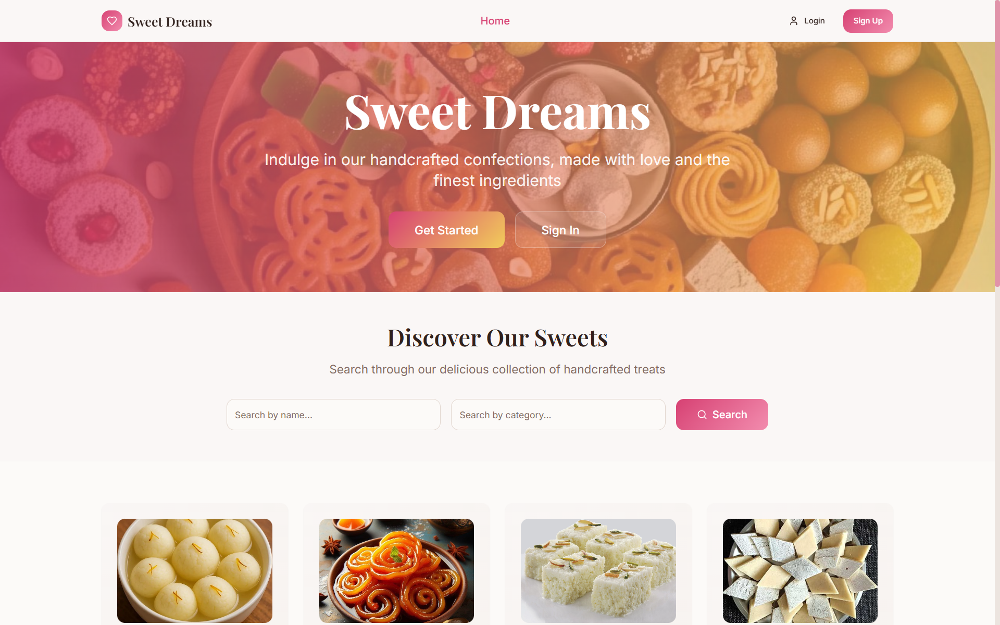
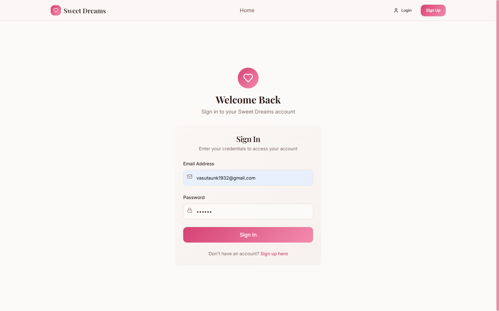
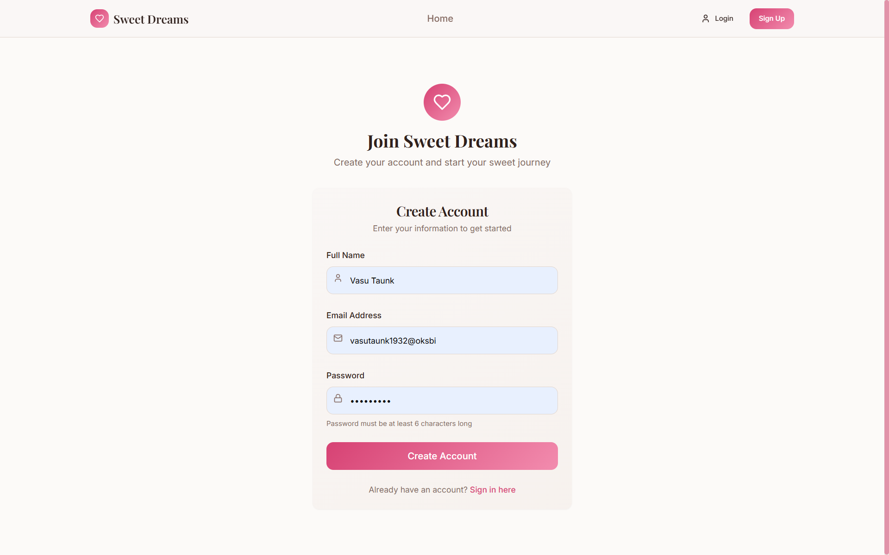
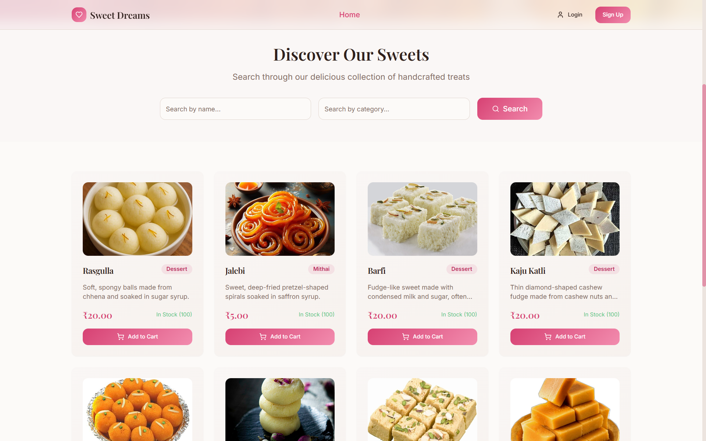
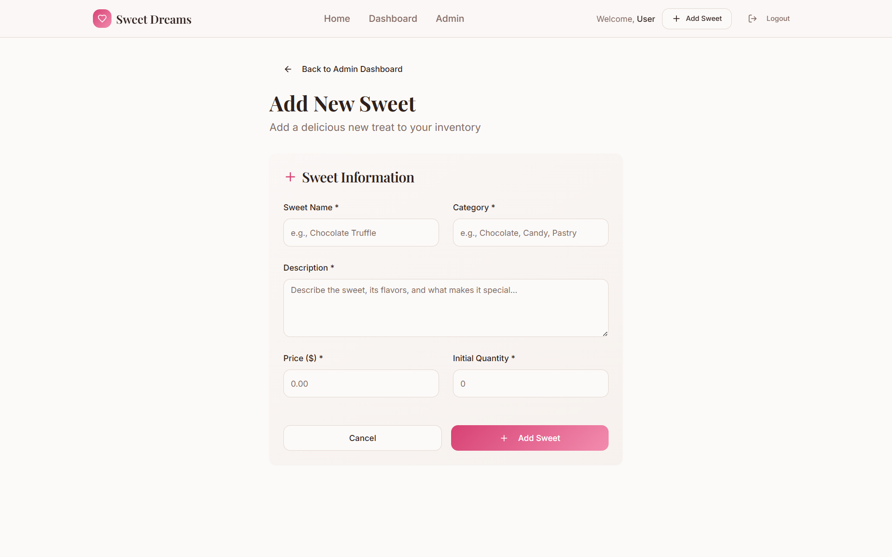
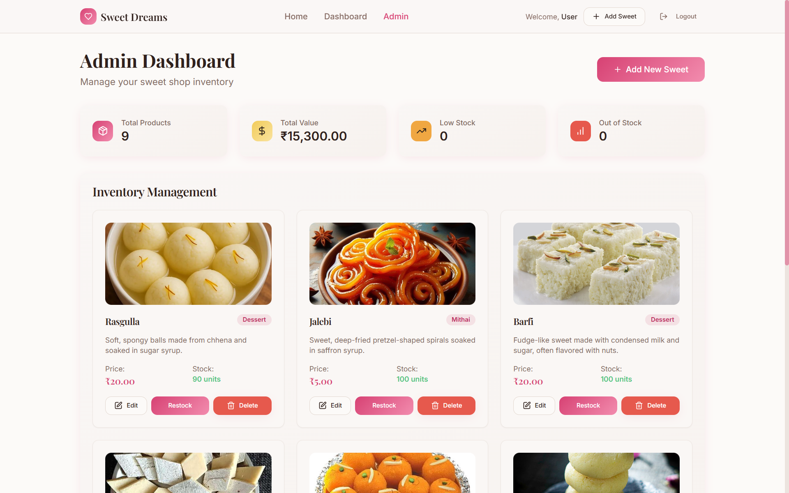
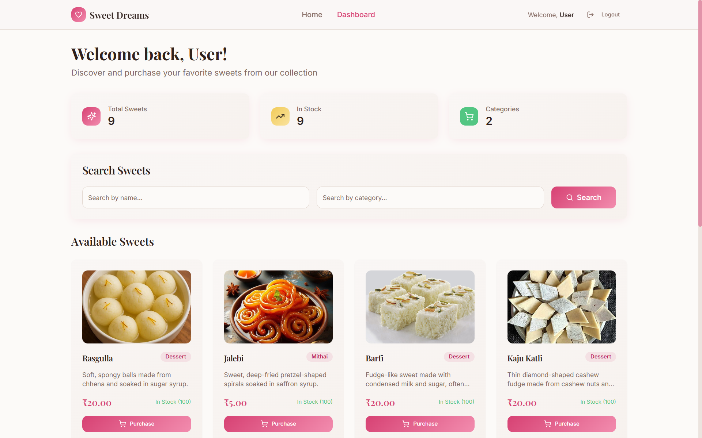
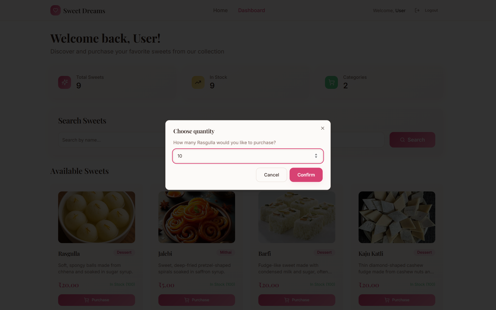

# SweetShop – Full Stack Application

## 📌 Project Overview
SweetShop is a full-stack web application built using **Spring Boot (backend)** and **React (frontend)**.  
Sweet shop management, supporting customer browsing, purchasing, and admin inventory control. Features user authentication, real-time sweet availability, and an admin dashboard for CRUD operations on sweets.

**Key Features:**
- User registration & login
- Dashboard with sweets listing, search, filter, and purchase
- Admin panel for adding, editing, and deleting sweets
- Responsive, creative UI and Persistent storage using MySQL 
---

## 🛠️ Tech Stack
**Frontend:** React, Axios, Tailwind CSS  
**Backend:** Spring Boot, JPA, Hibernate, MySQL  
**Other:** Docker, GitHub, AWS (deployment)  

---

## ⚙️ Project Setup (Local)

### ✅ Prerequisites
- [Java JDK](https://www.oracle.com/java/technologies/javase-downloads.html) (>= 17)  
- [Maven](https://maven.apache.org/)  
- [MySQL](https://dev.mysql.com/downloads/)
- ## Getting Started

### Backend Setup
1. Clone the repository:
   ```
   git clone https://github.com/vtaunk1932/sweet_shop_management.git
   ```
2. Install dependencies:
   ```
   cd sweet_shop_management
   npm install
   ```
3. Configure environment variables:
   - Copy `.env.example` to `.env` and set your values.

4. Run the backend server:
   ```
   npm start
   ```

### Frontend Setup
1. Clone the frontend repo:
   ```
   git clone https://github.com/vtaunk1932/sweet_management_shop_frontend.git
   ```
2. Install dependencies:
   ```
   cd sweet_management_shop_frontend
   npm install
   ```
3. Start the development server:
   ```
   npm start
   ```

Open [http://localhost:5173](http://localhost:5173) in your browser to view the app.  

---
## 📸 Screenshots

# SweetShop

## 🏠 Homepage


## 🔒 Login Page


## 📝 Sign Up Page


## 🍬 Sweet Categories


## ➕ Add Sweet (Admin)


## 🧑‍💼 Admin Dashboard


## 👤 User Dashboard


## 🛒 User Purchase


## Test Report

This project follows Test-Driven Development (TDD). All major backend logic was implemented following the Red-Green-Refactor cycle.

**To run tests:**
```
npm test
```

👉 You can view the detailed **test report** here:  
[View Test Report](./test-report.txt)

**Sample Test Coverage Output:**

```
PASS  tests/sweets.test.js
  ✓ should create a sweet (xx ms)
  ✓ should not create sweet with missing fields (xx ms)
...
-----------------------|---------|----------|---------|---------|
File                   | % Stmts | % Branch | % Funcs | % Lines |
-----------------------|---------|----------|---------|---------|
All files              |     95% |      90% |     92% |   94.5% |
-----------------------|---------|----------|---------|---------|

```
## My AI Usage

- **AI Tools Used:** GitHub Copilot, ChatGPT
- **How I used AI:**
  - Used Copilot to scaffold React components and backend test files.
  - Asked ChatGPT for help structuring the API and for TDD best practices.
  - Used Copilot to generate some test case templates, which I then customized.
- **Reflection:**
  - AI helped me move faster, especially with boilerplate and test coverage.
  - I always reviewed and edited AI suggestions for correctness and style.
  - AI was especially helpful for brainstorming refactoring ideas and edge case tests.
### 🖥️ Backend Setup (Spring Boot)
1. Clone the repository:
   ```bash
   git clone https://github.com/your-username/sweetshop.git
   cd sweetshop/backend
